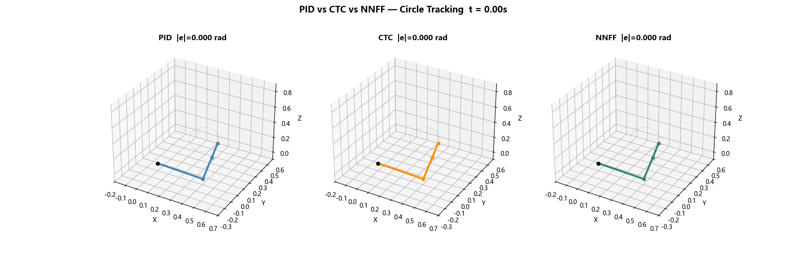

# 3-DOF 机械臂轨迹跟踪：PID vs 计算力矩 vs 神经网络前馈

<p align="center">
  
</p>

<p align="center">
  <b>CTC 跟踪精度 0.0012 rad · 末端等效误差 < 2 mm · NN 前馈比 PID 提升 20–30 倍</b>
</p>

<p align="center">
  
  
  
</p>

---

## Quick Start

```bash
pip install -r requirements.txt
python scripts/4_train_nn.py           # 训练 NN 逆动力学（~2 min）
python scripts/6_compare.py            # PID vs CTC vs NNFF 对比
python scripts/7b_compare_anim.py      # 并排对比动画
pytest tests/ -v                        # 单元测试（17 个）
```

---

## 结果

4 种轨迹条件 × 3 种控制器，关节空间 RMSE（rad）：

| 轨迹 | PID（无模型） | CTC（精确模型） | NNFF（学习模型） |
|------|:----------:|:------------:|:--------------:|
| 圆形 T=4s | 0.087 | **0.0012** | 0.0030 |
| 圆形 T=3s | 0.093 | **0.0019** | 0.0043 |
| 八字 T=5s | 0.081 | **0.0013** | 0.0031 |
| 八字 T=3s | 0.093 | **0.0027** | 0.0039 |

物理意义（0.9 m 臂展）：

| 控制器 | 关节误差 | 末端等效 |
|--------|:------:|:------:|
| CTC | ~0.1° | **< 2 mm** |
| NNFF | ~0.2° | ~3.6 mm |
| PID | ~5° | ~8 cm |

---

## 背景

本项目针对 3-DOF 空间机械臂的轨迹跟踪问题，实现并对比三种控制策略：

1. **PID** — 无模型，纯反馈硬扛非线性。精度最差，但零依赖。
2. **CTC（计算力矩控制）** — 解析动力学反馈线性化。理论上限。
3. **NNFF（神经网络前馈）** — 数据驱动逆动力学学习。不依赖解析模型，从 5 万组采样中学习。

三者放在同一个框架下对比，比单独实现一个控制器更能体现对"控制理论 + 深度学习"结合的系统理解。

---

## 系统描述

### 机械臂

3-DOF 拟人臂：底座旋转 (θ₁, 绕 z) → 肩部俯仰 (θ₂) → 肘部俯仰 (θ₃)。连杆 2 与连杆 3 共轴，无腕关节。

| 参数 | l₁ | l₂ | l₃ | m₁ | m₂ | m₃ | g |
|------|----|----|----|----|----|----|---|
| 值 | 0.4 m | 0.3 m | 0.2 m | 2.0 kg | 1.5 kg | 1.0 kg | 9.81 m/s² |

### 动力学

Euler-Lagrange 方法，点质量近似，4 阶 RK4 积分（步长 1 ms）：

$$M(\mathbf{q})\ddot{\mathbf{q}} + C(\mathbf{q},\dot{\mathbf{q}})\dot{\mathbf{q}} + G(\mathbf{q}) = \boldsymbol{\tau}$$

### 控制器接口

三者共享统一接口：`compute_torque(t, q, dq, q_des, dq_des, ddq_des) → τ`

| 控制器 | 公式 | 特点 |
|--------|------|------|
| **PID** | $\tau_i = K_p e_i + K_d \dot{e}_i + K_i \int e_i dt$ | 独立关节 + anti-windup |
| **CTC** | $\tau = M(\ddot{q}_{des} + K_p e + K_d \dot{e}) + C\dot{q} + G$ | 反馈线性化，$\omega_n=20,\zeta=0.8$ |
| **NNFF** | $\tau = f_{NN}(q_{des},\dot{q}_{des},\ddot{q}_{des}) + K_p e + K_d \dot{e}$ | MLP(9→256→512→256→3), 50k 样本 |

### 轨迹

45° 倾斜平面上两条轨迹，末端 Jacobian 传播速度/加速度：

- 圆形：$u = R\cos(\omega t), v = R\sin(\omega t)$，$R=0.12$ m
- 八字形：$u = a\sin(\omega t), v = b\sin(2\omega t)$，$a=0.12,b=0.06$ m

逆运动学：$\theta_1 = \text{atan2}(y, x)$ 定平面 → 平面内双连杆几何解 $\theta_2,\theta_3$。

---

## 项目结构

```
src/
  arm.py            # 正运动学、Jacobian、M/C/G、RK4
  controllers.py    # PID (anti-windup)、CTC、NN Feedforward
  trajectories.py   # 倾斜平面轨迹 + 逆运动学
  simulate.py       # 共享仿真器
  viz.py            # 3D 可视化、对比图、动画
scripts/
  1_passive.py           # 自由摆动 → 能量守恒验证
  2_pid.py               # PID 轨迹跟踪
  3_ctc.py               # CTC 轨迹跟踪
  4_train_nn.py          # 采样 + 训练逆动力学网络
  5_nn_test.py           # NN 前馈测试
  6_compare.py           # 三方法综合对比
  7_animate.py           # 单控制器动画
  7b_compare_anim.py     # 三臂并排动画
tests/               # pytest（17 tests）
```

---

## 引用

```bibtex
@misc{3dof-arm-ctl,
  author = {czh-089},
  title  = {3-DOF Robot Arm Trajectory Tracking: PID vs CTC vs NN Feedforward},
  year   = {2026},
  url    = {https://github.com/czh-089/3dof-arm-ctl}
}
```

## License

MIT
